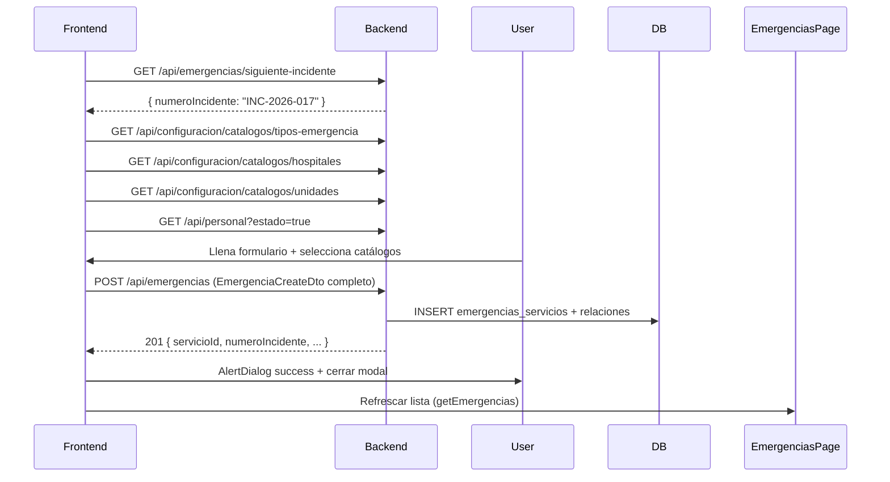

# Análisis Módulo Emergencias — Frontend vs Backend vs Base de Datos

## Resumen Ejecutivo

**Estado actual:** El frontend tiene formularios completos (`RegisterServicePage`, `EditServicePage`) pero **NO envían peticiones reales al backend** — solo simulan éxito con modales locales. Hay **desacoples críticos** entre campos del formulario, DTOs del backend y columnas de la BD que causarán errores 400/500 al integrar.

---

## 1. Discrepancias Críticas (Frontend → Backend DTO → BD)

### 1.1 Campos que EXISTEN en Frontend pero FALTAN en DTO/BD

| Campo Frontend | RegisterServicePage | EditServicePage | Backend DTO | BD Column | Acción Requerida |
|----------------|-------------------|-----------------|-------------|-----------|------------------|
| `domicilio` | ✅ (línea 87, 689) | ✅ (línea 110, 596) | ✅ `Domicilio` | ✅ `domicilio` | **OK** — ya existe |
| `fecha` | ✅ (línea 86) | ✅ (línea 109, 134) | ✅ `Fecha` | ✅ `fecha` | **OK** |
| `horaToma` (signos vitales) | ✅ (línea 88) | ✅ (línea 111) | ❌ **FALTA** en `SignosVitalesDto` | ✅ `hora_toma` | **AGREGAR** `HoraToma` a `SignosVitalesDto` |
| `genero` | ✅ (línea 68, 658) | ✅ (línea 96, 565) | ✅ `Genero` | ✅ `genero` | **OK** |
| `estadoEntrega` | ✅ (línea 76, 819) | ✅ (línea 104, 727) | ✅ `EstadoEntrega` | ✅ `estado_entrega` | **OK** |

### 1.2 Campos que EXISTEN en Backend/BD pero FALTAN en Frontend

| Campo Backend/BD | DTO Property | BD Column | Frontend | Acción Requerida |
|------------------|--------------|-----------|----------|------------------|
| `TipoEmergenciaId` | ❌ No en DTO | `tipo_emergencia_id` FK | ❌ No hay selector | **AGREGAR** dropdown "Tipo de Emergencia" (cat_tipos_emergencia) |
| `HospitalDestinoId` | ❌ No en DTO | `hospital_destino_id` FK | ❌ Solo nombre texto | **AGREGAR** selector hospitales (cat_hospitales) |
| `UnidadAsignadaId` | ❌ No en DTO | `unidad_asignada_id` FK | ❌ Solo nombre texto | **AGREGAR** selector unidades (cat_unidades) |
| `FormuladoPorId` | ❌ No en DTO | `formulado_por_id` FK (Guid) | ❌ Solo `CreadoPorNombre` | **AGREGAR** vinculación a usuario logueado |
| `Resumen` | ✅ `Resumen` | `resumen` | ❌ No hay campo | **AGREGAR** textarea "Resumen del incidente" |
| `Estado` | ✅ `Estado` | `estado` | ❌ No gestionado | **AGREGAR** en EditServicePage |

### 1.3 Estructura de Arrays — Mismatch Crítico

| Frontend | Backend DTO | BD Tabla | Problema |
|----------|-------------|----------|----------|
| `tiposAsistencia: string[]` | `TiposAsistencia: List<string>` | `servicio_tipos_asistencia` (servicio_id, tipo_asistencia) | **OK** — coincide |
| `personalDisponible: string[]` (solo nombres) | `PersonalAsignado: List<PersonalAsignadoDto>` { NombrePersonal, RolEnServicio } | `servicio_personal_asignado` (servicio_id, personal_id?, nombre_personal, rol_en_servicio) | **CRÍTICO** — Frontend no captura `RolEnServicio` ni `PersonalId` |
| `unidad: string` (una sola) | `UnidadAsignadaNombre: string` | `unidad_asignada_id` FK | **PARCIAL** — Falta ID real, solo nombre |

### 1.4 Signos Vitales — Discrepancia de Tipos

| Campo | Frontend (string) | Backend DTO | BD | Problema |
|-------|-------------------|-------------|-----|----------|
| `presionArterial` | string "120/80" | string? | string? | **OK** |
| `frecuenciaCardiaca` | string | **int?** | int? | **CAST REQUERIDO** — parseInt antes de enviar |
| `frecuenciaRespiratoria` | string | **int?** | int? | **CAST REQUERIDO** |
| `saturacion` | string | **int?** | int? | **CAST REQUERIDO** |
| `horaToma` | string "HH:mm" | **FALTA en DTO** | TimeSpan | **AGREGAR HoraToma a SignosVitalesDto** |

---

## 2. Análisis de RegisterServicePage.tsx (1049 líneas)

### 2.1 Estado Actual
- **NO usa `emergenciaService.ts`** — usa `fetch` directo a `http://localhost:5196/api/emergencias/siguiente-incidente` (línea 92)
- **handleSubmit (línea 125-167)** solo muestra modal de éxito, **no hace POST real**
- Datos hardcodeados en arrays locales:
  - `tiposAsistencia` inicial (línea 63): 5 valores hardcodeados
  - `personalDisponible` (línea 78): 3 nombres hardcodeados
  - `HOSPITALES` en select (líneas 592-594): 3 opciones hardcodeadas
  - `UNIDADES` en select (líneas 864-866): 3 opciones hardcodeadas

### 2.2 Campos del Formulario (mapeo a DTO)

```typescript
// Lo que ENVÍA el frontend (simulado):
{
  numeroIncidente: "INC-2026-001",      // ← readonly, viene de /siguiente-incidente
  fecha: "2026-10-05",                   // ← date input
  horaSalida: "08:30",                   // ← time input
  horaEntrada: "09:15",                  // ← time input
  solicitudTipo: "Telefónica",           // ← radio buttons
  tiposAsistencia: ["Accidente de Tránsito"], // ← chips seleccionados
  ubicacion: "Aldea X",                  // ← input text (REQUERIDO)
  hospital: "Hospital Nacional de Sololá", // ← select (solo nombre)
  nombrePaciente: "Juan Pérez",          // ← input text (REQUERIDO)
  edad: "25",                            // ← input number
  genero: "Masculino",                   // ← select
  solicitante: "Carlos",                 // ← input text
  acompanante: "María",                  // ← input text
  fallecido: false,                      // ← toggle buttons
  domicilio: "Calle 1",                  // ← input text
  presionArterial: "120/80",             // ← input text
  frecuenciaCardiaca: "72",              // ← input text → **parseInt needed**
  frecuenciaRespiratoria: "16",          // ← input text → **parseInt needed**
  saturacion: "98",                      // ← input text → **parseInt needed**
  estadoEntrega: "Estable",              // ← select
  unidad: "Unidad A-33 (Ambulancia)",    // ← select (solo nombre)
  personalDisponible: ["Bombero 1.º Juan Pérez"], // ← chips → **falta RolEnServicio**
  horaToma: "08:45"                      // ← time input → **FALTA en DTO**
}
```

### 2.3 Validaciones Actuales (líneas 126-137)
```typescript
// Solo valida 3 campos:
if (tiposAsistencia.length === 0) newErrors.tiposAsistencia = true;
if (!ubicacion.trim()) newErrors.ubicacion = true;
if (!nombrePaciente.trim()) newErrors.nombrePaciente = true;
```
**FALTAN validaciones:** edad (0-120), horaSalida/horaEntrada formato, saturación (0-100), etc.

---

## 3. Análisis de EditServicePage.tsx (891 líneas)

### 3.1 Estado Actual
- Recibe `service: Service` (tipo local de EmergenciasPage, **NO** `EmergenciaResponseDto` del backend)
- `onSave` callback devuelve `Service` local, **no llama a API real**
- **Mapeo inverso problemático** (líneas 166-192): filtra personal por nombre hardcodeado (`includes("Bombero")`, `includes("Socorrista")`) para separar pilotos/camilleros

### 3.2 Campos que NO se cargan del servicio existente
```typescript
// En useEffect (líneas 113-138) NO se cargan:
setPresionArterial("");           // ← Signos vitales se pierden
setFrecuenciaCardiaca("");        // ←
setFrecuenciaRespiratoria("");    // ←
setSaturacion("");                // ←
setEstadoEntrega("");             // ←
setGenero("");                    // ← Género no viene en tipo Service
setHoraToma(...);                 // ← Hora toma signos vitales
```

---

## 4. Análisis de EmergenciasPage.tsx (1200+ líneas)

### 4.1 Tipo `Service` Local vs Backend Response
```typescript
// Frontend tipo local (líneas 14-38):
type Service = {
  id: string;                    // ← NumeroIncidente (ej: "INC-2026-001")
  fecha: string;                 // ← "5 octubre 2026"
  hora: string;                  // ← Hora salida
  tipo: string;                  // ← Primer tipo asistencia
  // ... muchos campos para impresión oficial
  tiposServicio: string[];       // ← Array de strings
  unidades: string[];            // ← Nombres unidades
  pilotos: string[];             // ← Nombres
  camilleros: string[];          // ← Nombres
  // FALTAN: servicioId (int), signosVitales, personalAsignado con roles, etc.
}
```

### 4.2 Datos Mock (línea 41)
```typescript
const INITIAL_SERVICES: Service[] = [];  // ← VACÍO, no carga del backend
```
**NO hay useEffect que llame a `emergenciaService.getEmergencias()`**

### 4.3 Filtros Hardcodeados (líneas 979-993)
```typescript
<option>A-33</option><option>BD-01</option><option>AD-02</option>
// Deberían venir de /api/configuracion/catalogos/unidades
```

---

## 5. Análisis de AlertDialog.tsx (166 líneas)

### 5.1 Capacidad Actual
```typescript
type AlertType = "success" | "warning" | "error" | "incomplete";
```
- **4 tipos visuales** con iconos y colores distintos
- Auto-close en 3.5s para `warning`/`incomplete`
- Un solo botón "Aceptar"
- Modal centrado, overlay oscuro

### 5.2 Alertas NECESARIAS para Emergencias (no implementadas)

| Situación | Tipo | Título | Mensaje | Acción Requerida |
|-----------|------|--------|---------|------------------|
| Validación fallida (campos requeridos) | `incomplete` | "Campos Incompletos" | "Complete los campos obligatorios: [lista]" | Ya implementada en RegisterServicePage (modal custom) |
| Error de red / API 500 | `error` | "Error de Servidor" | "No se pudo conectar con el servidor. Intente nuevamente." | **FALTA** |
| Error 400 (validación backend) | `error` | "Datos Inválidos" | "[mensaje del backend]" | **FALTA** |
| DPI/Incidente duplicado | `error` | "Registro Duplicado" | "El número de incidente ya existe." | **FALTA** |
| Registro exitoso | `success` | "Emergencia Registrada" | "Incidente INC-2026-XXX guardado correctamente." | Parcial (modal custom) |
| Actualización exitosa | `success` | "Cambios Guardados" | "El servicio ha sido actualizado." | **FALTA** |
| Eliminación/Desactivación | `warning` | "Confirmar Desactivación" | "¿Marcar este servicio como Inactivo?" | Existe en EmergenciasPage (inline) |
| Sin permisos (403) | `error` | "Sin Autorización" | "No tiene permisos para esta acción." | **FALTA** |
| Sesión expirada (401) | `error` | "Sesión Expirada" | "Su sesión ha expirado. Inicie sesión nuevamente." | **FALTA** |
| Carga de catálogos fallida | `warning` | "Datos Incompletos" | "No se pudieron cargar hospitales/unidades. Algunas listas estarán vacías." | **FALTA** |

### 5.3 Mejoras Requeridas a AlertDialog
1. **Callback opcional en confirmación** — `onConfirm?: () => void` para acciones destructivas
2. **Variant "confirm"** — dos botones (Cancelar / Confirmar) para acciones irreversibles
3. **Soporte para lista de errores** — `details?: string[]` para mostrar múltiples validaciones
4. **Integración con `sonner` (toast)** — para notificaciones no bloqueantes (éxito, info)

---

## 6. Plan de Implementación — Archivos a Modificar

### 6.1 Backend (Prioridad Alta)

| Archivo | Cambio |
|---------|--------|
| `DTOs/EmergenciaCreateDto.cs` | Agregar `HoraToma` a `SignosVitalesDto` |
| `DTOs/EmergenciaUpdateDto.cs` | Agregar `HoraToma` a `SignosVitalesDto`; agregar `TipoEmergenciaId`, `HospitalDestinoId`, `UnidadAsignadaId`, `FormuladoPorId`, `Resumen` |
| `Controllers/EmergenciasController.cs` | Implementar `GET /api/emergencias` (paginado + filtros), `GET /api/emergencias/{id}`, `PUT /api/emergencias/{id}`, `PATCH /api/emergencias/{id}/estado` |
| `Services/EmergenciaService.cs` | Lógica de mapeo DTO → Entidad + guardado relaciones (TiposAsistencia, PersonalAsignado, SignosVitales) |

### 6.2 Frontend — Servicios y Tipos

| Archivo | Cambio |
|---------|--------|
| `src/types/emergencia.ts` | Alinear `EmergenciaCreate`/`EmergenciaUpdate` con DTOs backend; agregar `TipoEmergenciaId`, `HospitalDestinoId`, `UnidadAsignadaId`, `FormuladoPorId`, `Resumen`, `HoraToma` en `SignosVitales` |
| `src/services/emergenciaService.ts` | Implementar `registrarEmergencia`, `actualizarEmergencia`, `getEmergencias` (paginado), `getEmergenciaById`, `cambiarEstado`; **eliminar mocks** |
| `src/hooks/useEmergencias.ts` | Hook para manejo de estado + carga catálogos (tipos emergencia, hospitales, unidades, personal) |

### 6.3 Frontend — Páginas

| Archivo | Cambio |
|---------|--------|
| `RegisterServicePage.tsx` | **Reescribir handleSubmit** para usar `emergenciaService.registrarEmergencia`; agregar selects dinámicos (Tipo Emergencia, Hospital, Unidad) desde catálogos; agregar campo `Resumen`; parsear signos vitales a number; capturar `RolEnServicio` por personal; mostrar `AlertDialog` para errores/éxito |
| `EditServicePage.tsx` | Cargar datos completos via `getEmergenciaById`; mapear `PersonalAsignadoDto[]` → UI con roles; `handleSubmit` usa `actualizarEmergencia`; integrar `AlertDialog` |
| `EmergenciasPage.tsx` | `useEffect` inicial llama `getEmergencias()`; reemplazar `Service` local por `EmergenciaListItemDto`; filtros usan API; botón "Registrar" abre `RegisterServicePage` en modal; tabla con paginación real |

### 6.4 Componentes Compartidos

| Archivo | Cambio |
|---------|--------|
| `src/app/components/AlertDialog.tsx` | Agregar variant `confirm` (dos botones), prop `details?: string[]`, callback `onConfirm`; exportar `AlertDialogConfirm` wrapper |
| `src/app/components/ui/AlertSystem.tsx` / `sonner` | Usar toasts para éxito/info no bloqueantes; reservar `AlertDialog` para errores y confirmaciones críticas |

---

## 7. Catálogos Requeridos (Cargar al Montar Formularios)

| Catálogo | Endpoint | Uso en Formulario |
|----------|----------|-------------------|
| Tipos de Emergencia | `GET /api/configuracion/catalogos/tipos-emergencia` | Select "Tipo de Emergencia" (requerido si `requiere_unidad=true`) |
| Hospitales | `GET /api/configuracion/catalogos/hospitales` | Select "Hospital de Destino" |
| Unidades | `GET /api/configuracion/catalogos/unidades` | Select "Unidad Asignada" |
| Personal Disponible | `GET /api/personal/disponible` o `GET /api/personal?estado=true` | Chips personal con selector de `RolEnServicio` (Piloto, Socorrista, Camillero, etc.) |
| Roles de Servicio | `GET /api/configuracion/catalogos/roles-servicio` | Dropdown `RolEnServicio` por cada personal asignado |

---

## 8. Flujo de Datos Corregido (Registro)



---

## 9. Archivos de Referencia Rápida

| Archivo | Línea Clave | Nota |
|---------|-------------|------|
| `RegisterServicePage.tsx` | 125-167 | `handleSubmit` — **REEMPLAZAR** por llamada real a API |
| `EditServicePage.tsx` | 153-197 | `handleSubmit` — **REEMPLAZAR** por `actualizarEmergencia` |
| `EmergenciasPage.tsx` | 757-770 | `services` state — **CARGAR** desde API en `useEffect` |
| `emergenciaService.ts` | 18-105 | **IMPLEMENTAR** métodos faltantes (getEmergencias, actualizar, etc.) |
| `EmergenciaCreateDto.cs` | 7-27 | **REFERENCIA** para mapeo frontend→backend |
| `EmergenciaServicio.cs` | 11-113 | **ESQUEMA BD** completo |
| `AlertDialog.tsx` | 107-166 | **EXTENDER** con variant `confirm` y `details` |

---

## 10. Checklist de Validación Pre-Integración

- [ ] `SignosVitalesDto.HoraToma` agregado en backend
- [ ] `TipoEmergenciaId`, `HospitalDestinoId`, `UnidadAsignadaId`, `FormuladoPorId`, `Resumen` en DTOs
- [ ] Endpoints `GET /api/emergencias`, `GET /api/emergencias/{id}`, `PUT /api/emergencias/{id}`, `PATCH /api/emergencias/{id}/estado` implementados
- [ ] `emergenciaService.ts` con todos los métodos CRUD + paginación
- [ ] `RegisterServicePage` usa `emergenciaService.registrarEmergencia` + `AlertDialog`
- [ ] `EditServicePage` carga datos reales + `emergenciaService.actualizarEmergencia`
- [ ] `EmergenciasPage` lista desde API + paginación + filtros servidor
- [ ] Catálogos dinámicos en selects (no hardcodeados)
- [ ] `AlertDialog` soporta `confirm` variant + `details` array
- [ ] Signos vitales parsean `string` → `number` antes de enviar
- [ ] Personal asignado incluye `RolEnServicio` y opcional `PersonalId`
- [ ] Manejo de errores 400/401/403/500 con `AlertDialog` apropiado

---

## 11. Estimación de Esfuerzo

| Tarea | Complejidad | Tiempo Estimado |
|-------|-------------|-----------------|
| Backend DTOs + Controller + Service | Media | 4-6 hrs |
| Frontend tipos + emergenciaService | Media | 3-4 hrs |
| RegisterServicePage refactor | Alta | 4-5 hrs |
| EditServicePage refactor | Media | 3-4 hrs |
| EmergenciasPage refactor (lista + paginación) | Alta | 4-6 hrs |
| AlertDialog extensiones | Baja | 1-2 hrs |
| **Total** | | **19-27 hrs** |

---

## 12. Próximos Pasos Recomendados

1. **Iniciar por backend**: Completar DTOs y endpoints GET/POST/PUT para tener contrato estable
2. **Actualizar `emergenciaService.ts`**: Tipos alineados + métodos reales
3. **Refactor `RegisterServicePage`**: Es el más crítico — registro nuevo
4. **Refactor `EmergenciasPage`**: Lista + paginación + abrir modal registro/edición
5. **Refactor `EditServicePage`**: Cargar datos reales + guardar cambios
6. **Extender `AlertDialog`**: Variant confirm + details
7. **Testing E2E**: Registro → Lista → Edición → Desactivación → Impresión